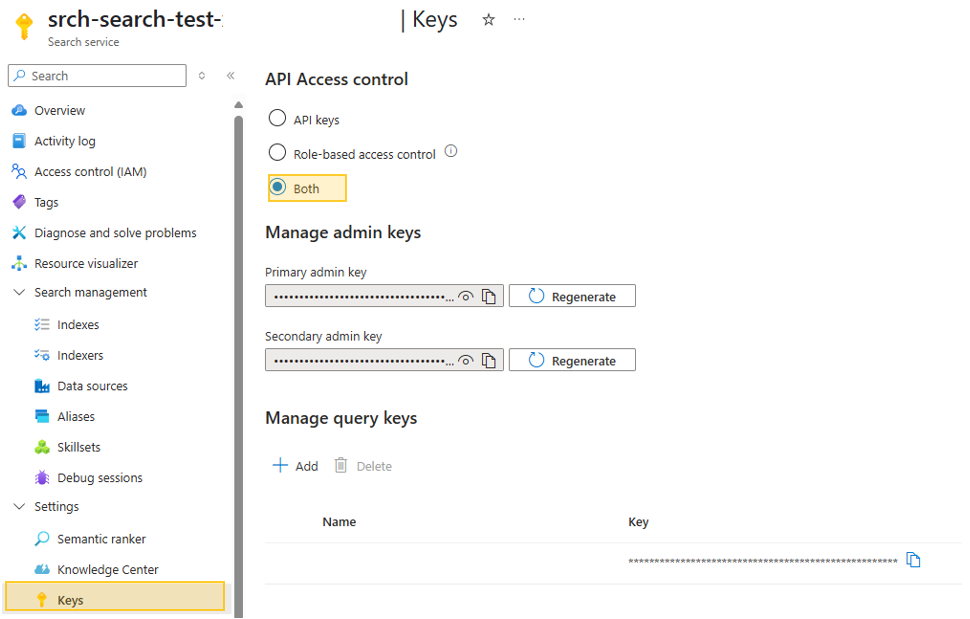
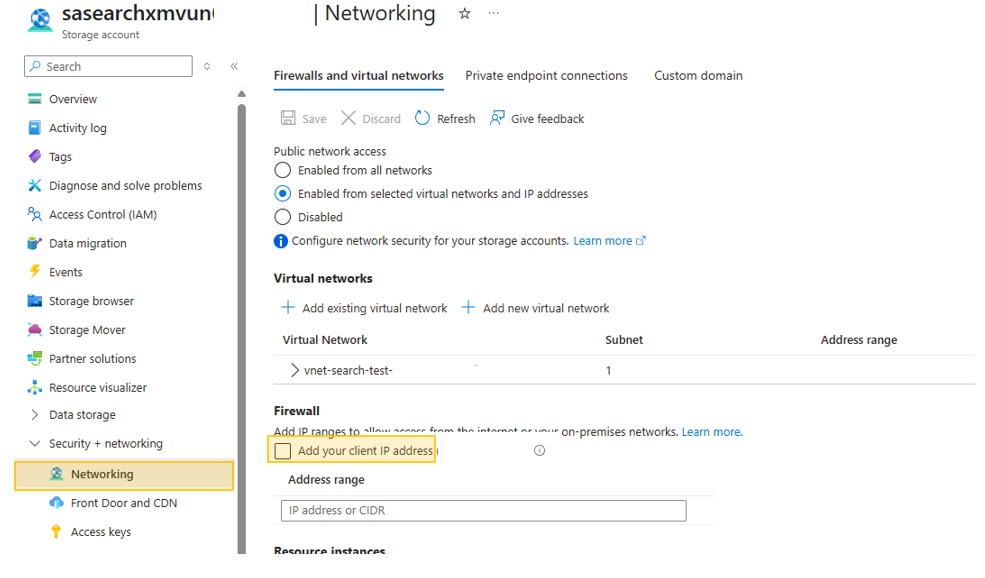
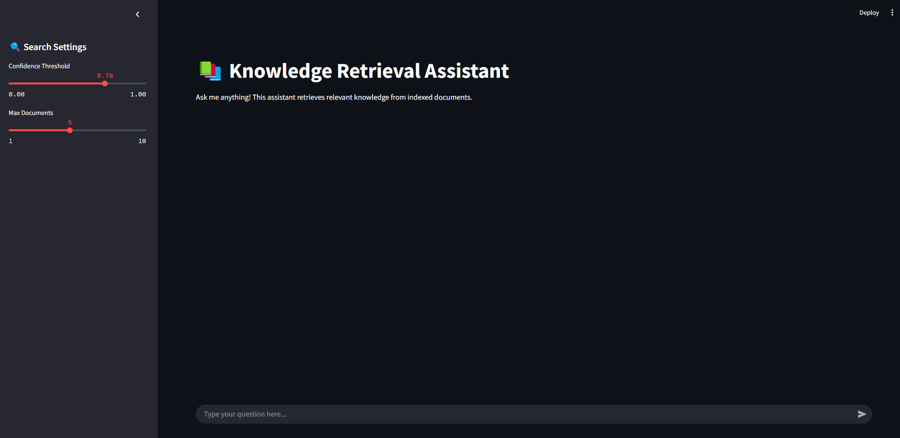

> ⚠️
> **This project is currently in active development and may contain breaking changes.**  
> Updates and modifications are being made frequently, which may impact stability or functionality. This notice will be removed once development is complete and the project reaches a stable release.

# Azure AI Search Document Retrieval for RAG Implementation: Chunking and Vector Search


## Overview

This project aims to perform **Azure AI Search** document retrieval for **RAG (Retrieval-Augmented Generation)** implementations, focusing on evaluating different document chunking patterns and vector search algorithms. The goal is to understand the performance and accuracy of different configurations for chunking, indexing, and retrieval when combined with **Azure OpenAI embeddings** and **GPT-4** for generating contextually relevant responses.

The system leverages **HNSW (Hierarchical Navigable Small World)** and other vector search algorithms for indexing and efficient retrieval. It compares the impact of various document chunking patterns on the quality of results and query handling in a RAG setup.


### Key Features:
- **Document Chunking Patterns**: Test various strategies for chunking large PDF documents, such as splitting by page, paragraph, or custom length-based strategies, to compare retrieval performance.
- **Vector Search Algorithms**: Implement **HNSW** and compare it with other vector search algorithms in **Azure AI Search** to determine the most effective method for RAG-based retrieval.
- **Semantic Search**: Use **Azure OpenAI embedding models** to generate vector embeddings for documents, enabling semantic search that goes beyond simple keyword matching.
- **GPT-4 Integration**: Use **GPT-4** to process query results and generate coherent, contextually relevant answers based on the retrieved documents.
- **Streamlit Front-End**: Offers a user-friendly interface to input queries, test retrieval performance, and compare different chunking patterns and vector search configurations.

---

## Resources  

This project implements Azure AI Search **push APIs** as the recommended method for indexing large documents. For more details, refer to:  
[Indexing Large Data Sets in Azure AI Search](https://learn.microsoft.com/en-us/azure/search/search-how-to-large-index)  

Furthermore, the document chunking strategies utilized in this project are outlined in:  
[Chunking Large Documents for Vector Search in Azure AI Search](https://learn.microsoft.com/en-us/azure/search/vector-search-how-to-chunk-documents)

---


## Requirements
- Azure subscription for deploying Azure GenAI RAG Application.
- [Azure CLI](https://learn.microsoft.com/en-us/cli/azure/get-started-with-azure-cli) (Command Line Interface)
- Python 3.11.4 installed on development environment.
- An IDE for Development, such as [VS Code](https://code.visualstudio.com/download)

## Usage

Follow these steps to set up and deploy the solution:

### 1. Clone the Repository from GitHub:  
Begin by cloning the repository to your local machine using the following command:

```bash
git clone https://github.com/jonathanscholtes/azure-ai-search-large-doc-indexing-vectorization.git
cd azure-ai-search-large-doc-indexing-vectorization
```


### 2. Deploy the Solution (if you don't have and Azure AI Search or Azure OpenAI/AI Foundry instance):  
Navigate to the deployment directory:

```bash
cd infra
```

Then, use the following PowerShell command to deploy the solution. Make sure to replace the placeholders with your actual subscription name, Azure Region (ResourceGroupLocation):

**PowerShell**
```bash
.\deploy.ps1 -Subscription '[Subscription Name]' -Location 'eastus2' 
```
This script will provision the necessary resources in your Azure subscription according to the specified parameters. The deployment may take upto **20 minutes** to provision all Azure resources.


---


## Running the LocalLoader Applicaiton for PDF Indexing

The **LocalLoader** is a Python application designed to demonstrate PDF chunking and indexing using Azure AI Search push APIs. For a more scalable solution capable of handling large volumes of documents, consider using the [Azure Function](#loader-function), which is also made available with this solution. 

### 1. Configure Environment Variables

To run the Loader application, you need to create a .env file and populate it with the required environment variables. Follow these steps:

1. In the LocalLoader project under [src/LocalLoader](src/LocalLoader), create a new file named .env.
2. Add the following variables and update them with your Azure service details (replace the placeholders with your endpoint and key details):

```
AZURE_AI_SEARCH_ENDPOINT='Your Azure AI Search Endpoint'
AZURE_AI_SEARCH_KEY='Your Azure AI Search Key'
AZURE_AI_SEARCH_INDEX='contract-index'
AZURE_OPENAI_EMBEDDING='text-embedding'
AZURE_OPENAI_API_VERSION='2024-06-01'
AZURE_OPENAI_ENDPOINT='Endpoint from deployed Azure AI Service or Azure OpenAI Service'
AZURE_OPENAI_API_KEY='Key from deployed Azure AI Service or Azure OpenAI Service'
OPENAI_API_VERSION='2024-06-01'
```

### 2. Enable Key-Based API Access for LocalLoader in Azure AI Search  

To use Azure AI Search with LocalLoader, you must enable key-based access for the API.  

##### Steps:  
1. Sign in to the [Azure Portal](https://portal.azure.com).  
2. Go to your **Azure AI Search** instance.  
3. In the **Settings** section, select **Keys**.  
4. Under **API Access Control**, choose **Both** to enable key-based authentication.



### 3. Set Up and Run the LocalLoader Application

Navigate to the Streamlit application directory [src/LocalLoader](src/LocalLoader) and follow these steps:

- Create a Python Virtual Environment:

```
python -m venv venv
```
- Activate the Virtual Environment and Install Dependencies:
```
venv\Scripts\activate # On macOS/Linux, use `source venv/bin/activate`
python -m pip install -r requirements.txt
```
- Process PDF files specified **--files** semicolon separated list of file paths:
```
python app.py --files "C:\path\to\file1.pdf;C:\path\to\file2.pdf"
```

This will initiate the chunking and indexing process for the PDF files into Azure AI Search. Please note that this may take some time to index the document chunks into Azure AI Search.

```
Batch 1/22 uploaded. Remaining: 21
Batch 2/22 uploaded. Remaining: 20
Batch 3/22 uploaded. Remaining: 19
Batch 4/22 uploaded. Remaining: 18
Batch 5/22 uploaded. Remaining: 17
Batch 6/22 uploaded. Remaining: 16
Batch 7/22 uploaded. Remaining: 15
```

---


## Loading Documents with Azure Function (Alternative to LocalLoader) {#loader-function} 

This project deploys the Azure Function [DocumentProcessingFunction](src/DocumentProcessingFunction) to process and index PDF documents into Azure AI Search using a blob trigger. Authentication between Azure services is handled through **managed identities**, providing a secure alternative to API keys. Alternatively, you can use [LocalLoader](src/LocalLoader), which relies on API keys for authentication.

**Azure Functions** provide a scalable, serverless solution that executes automatically based on events, reducing infrastructure management and optimizing costs by running only when needed.

### 1. Configure Storage Account Access  

To upload PDFs into the Azure Storage Account and enable embedding creation, you must allow access by configuring the Storage Account firewall settings. This ensures that your local environment can communicate with Azure services.

Follow these steps to add your client IP address to the firewall settings:

1. Log in to the [Azure portal](https://portal.azure.com).
2. Navigate to your **Storage Account**.
3. In the **Networking** section, go to **Firewall and virtual networks**.
4. Add your current client IP address to the list of allowed addresses.



### 2. Upload Documents for Indexing with Azure Function  

Upload PDF documents to the **load** container in the Azure Storage Account. This upload will trigger the document processing function, which will chunk and index the documents into Azure AI Search. 

---


## Running the Streamlit Application

### 1. Configure Environment Variables

To run the Streamlit application, you need to create a .env file and populate it with the required environment variables. Follow these steps:

1. In the Streamlit project under [src/Streamlit](src/Streamlit), create a new file named .env.
2. Add the following variables and update them with your Azure service details (replace the placeholders with your endpoint and key details):

```
AZURE_AI_SEARCH_ENDPOINT='Your Azure AI Search Endpoint'
AZURE_AI_SEARCH_KEY='Your Azure AI Search Key'
AZURE_AI_SEARCH_INDEX='contract-index'
AZURE_OPENAI_EMBEDDING='text-embedding'
AZURE_OPENAI_API_VERSION='2024-06-01'
AZURE_OPENAI_ENDPOINT='Endpoint from deployed Azure AI Service or Azure OpenAI Service'
AZURE_OPENAI_API_KEY='Key from deployed Azure AI Service or Azure OpenAI Service'
OPENAI_API_VERSION='2024-06-01'
AZURE_OPENAI_MODEL='gpt-4o'
```

### 2. Set Up and Run the Streamlit Application

Navigate to the Streamlit application directory [src/Streamlit](src/Streamlit) and follow these steps:

- Create a Python Virtual Environment:

```
python -m venv venv
```
- Activate the Virtual Environment and Install Dependencies:
```
venv\Scripts\activate # On macOS/Linux, use `source venv/bin/activate`
python -m pip install -r requirements.txt
```
- Start the Streamlit:
```
streamlit run app.py
```

This will launch the application in your browser, allowing you to interact with the SQL database using natural language queries.




---

## Clean-Up

After completing testing, ensure to delete any unused Azure resources or remove the entire Resource Group to avoid incurring additional charges.


## License
This project is licensed under the [MIT License](LICENSE.md), granting permission for commercial and non-commercial use with proper attribution.


## Disclaimer
This demo application is intended solely for educational and demonstration purposes. It is provided "as-is" without any warranties, and users assume all responsibility for its use.